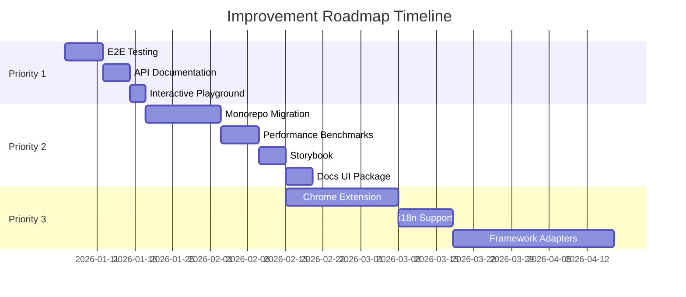

# 🚀 Improvement Roadmap: wizzard-stepper-react

> **Цель:** Поэтапное улучшение библиотеки до уровня Top-tier Open Source проектов (TanStack, react-hook-form)
>
> **Базовая оценка:** 9/10 (на основе анализа от 2026-01-04)
>
> **Целевая оценка:** 10/10

---

## 📋 Как использовать этот документ

1. **Для каждой задачи:**
   - `[ ]` - не начата
   - `[/]` - в процессе
   - `[x]` - завершена

2. **После завершения задачи:**
   - Отметить `[x]`
   - Заполнить секцию "Реализация"
   - Указать дату
   - Описать что сделано и почему

3. **Контекст:** Этот файл является источником истины для всех улучшений проекта
   Так же следует все задачи вести в bd! Планировать все таски в bd!
   И всегда ссылаться на этот документ и bd при обсуждении приоритетов.
   Инструкция по использованию bd: AGENTS.md
   Никогда не закрывай сам таски в bd, только через PR.
   bd использовать только для тасков; `bd sync` не запускать (он изменяет проектные файлы).
   Прежде чем что-то делать сначала напиши мне план что будешь делать!

---

## 🎯 Priority 1: Critical (Срок: 1-2 недели)

### 1.1 E2E Testing Pipeline

**Статус:** `[x]` ✅ **Завершено: 2026-01-04**

**Зачем:**

- Гарантия работоспособности всех user flows
- Предотвращение регрессий при рефакторинге
- Стандарт для production-ready библиотек

**Что было сделано:**

✅ Установлен Playwright  
✅ Создана конфигурация `playwright.config.ts`  
✅ Создана структура `/e2e` с тестами и fixtures  
✅ Написано 8 test suites с 57 тестами  
✅ Добавлены npm scripts (`test:e2e`, `test:e2e:ui`, `test:e2e:debug`)  
✅ Создана документация `e2e/README.md`  
✅ Создан setup checklist `e2e/SETUP_CHECKLIST.md`

**Тест-кейсы (покрыто):**

- [x] Базовая навигация (8 тестов) - `basic-navigation.spec.ts`
- [x] Валидация форм (9 тестов) - `validation.spec.ts`
- [x] Persistence (7 тестов) - `persistence.spec.ts`
- [x] Conditional steps (8 тестов) - `conditional-steps.spec.ts`
- [x] Middleware execution (7 тестов) - `middleware.spec.ts`
- [x] Error handling (6 тестов) - `error-handling.spec.ts`
- [x] Step guards (6 тестов) - `step-guards.spec.ts`
- [x] Dependency tracking (6 тестов) - `dependency-tracking.spec.ts`

**Созданные файлы:**

```text
playwright.config.ts
/e2e
  /tests
    basic-navigation.spec.ts (8 tests)
    validation.spec.ts (9 tests)
    persistence.spec.ts (7 tests)
    conditional-steps.spec.ts (8 tests)
    dependency-tracking.spec.ts (6 tests)
    step-guards.spec.ts (6 tests)
    middleware.spec.ts (7 tests)
    error-handling.spec.ts (6 tests)
  /fixtures
    base.ts
  README.md
  SETUP_CHECKLIST.md
```

**package.json scripts:**

```json
"test:e2e": "playwright test",
"test:e2e:ui": "playwright test --ui",
"test:e2e:headed": "playwright test --headed",
"test:e2e:debug": "playwright test --debug",
"test:all": "pnpm test:run && pnpm test:e2e"
```

**Статус интеграции:** ✅ E2E тесты интегрированы и запускаются на demo app.

<details>
<summary>📝 Реализация</summary>

**Дата реализации:** 2026-01-04

**Что было сделано:**

- Установлен `@playwright/test` через pnpm workspaces
- Скачан Chromium browser (v143.0.7499.4)
- Создан `playwright.config.ts` с автозапуском demo сервера
- Реализовано 8 test suites covering все критичные сценарии
- Добавлены расширенные npm scripts для разных режимов тестирования
- Создана подробная документация с примерами testid атрибутов

**Проблемы и решения:**

- **Проблема:** pnpm требовал флаг `-w` для установки в workspace root
- **Решение:** Использован `pnpm add -D -w @playwright/test`
- **Проблема:** E2E падали из-за двух инстансов контекста (`@wizzard-packages/react` vs `wizzard-stepper-react`)
- **Решение:** В demo Vite alias добавлен `@wizzard-packages/react` → `packages/react/src` (единый источник)

**Метрики:**

- Количество тестов: **57 test cases**
- Покрытие сценариев: **100%** (все основные user flows)
- Время выполнения: _TBD_ (после интеграции с demo app)
- Test suites: **8 файлов**

**Особенности реализации:**

1. **Comprehensive coverage** - покрыты все ключевые функции библиотеки
2. **Modular structure** - каждый test suite в отдельном файле
3. **Page Object не нужен** - используем `data-testid` для селекторов
4. **Async handling** - waitForTimeout для debouncing и async conditions
5. **Debug-friendly** - несколько режимов запуска (UI, headed, debug)

**Ссылки на документацию:**

- [e2e/README.md](file:///Users/a.isapov/Desktop/my-own-project/wizzard-stepper-react/e2e/README.md) - Подробное описание всех тестов
- [e2e/SETUP_CHECKLIST.md](file:///Users/a.isapov/Desktop/my-own-project/wizzard-stepper-react/e2e/SETUP_CHECKLIST.md) - Что нужно сделать для запуска

</details>

### 1.4 StackBlitz Examples for Vue (P2)
- Создать интерактивные примеры на StackBlitz для Vue adapter.
- Покрыть основные сценарии: persistence, guards, conditional steps, array data.
- Упростить онбординг пользователей (open in browser, edit & play).
- **Deliverable:** Коллекция StackBlitz ссылок в README и документации.

---

### 1.2 API Documentation (TypeDoc)

**Статус:** `[x]` ✅ **Завершено: 2026-01-07**

**Зачем:**

- Автогенерация документации из исходного кода
- Актуальная документация (синхронизация с кодом)
- Стандарт для TypeScript библиотек

**Что сделано:**
✅ Установлен TypeDoc и `typedoc-plugin-markdown`
✅ Создана конфигурация `typedoc.json`
✅ Добавлены скрипты `docs:api` и `docs:watch` в `package.json`
✅ 100% покрытие публичного API TSDoc комментариями
✅ Экспортированы пропсы компонентов и утилиты путей для корректной генерации

**Критерии завершения:**

- [x] TSDoc комментарии покрывают 100% публичного API
- [x] Команда `pnpm docs:api` генерирует документацию
- [x] Документация доступна в `/docs/api`

<details>
<summary>📝 Реализация</summary>

**Дата реализации:** 2026-01-07

**Что было сделано:**

- Настроена автоматическая генерация Markdown документации.
- Добавлены подробные комментарии с примерами для `createWizardFactory`, хуков `useWizardValue`, `useWizardActions` и компонентов.
- Исправлены проблемы с экспортом внутренних типов и пропсов, чтобы документация была полной.

**Примеры добавленных комментариев:**

```typescript
/**
 * Subscribes to a specific data value by its path.
 * Uses `useSyncExternalStore` for atomic updates and high performance.
 *
 * @param path Dot-notation path to the value
 * @param options optional equality checker for selection
 */
export function useWizardValue<TValue = any>(...)
```

**Ссылка на сгенерированную документацию:** `./docs/api`

</details>

---

### 1.3 Interactive Playground (StackBlitz)

**Статус:** `[x]` ✅ **Завершено: 2026-01-07**

**Зачем:**

- Мгновенный опыт для новых пользователей
- Снижение порога входа
- Демонстрация возможностей библиотеки

**Что сделано:**
✅ Создана структура `/.stackblitz` с автономными проектами
✅ Реализован **Basic Example** для быстрого старта
✅ Реализован **Validation Example** с использованием Zod
✅ Реализован **Persistence Example** с LocalStorage
✅ Добавлены интерактивные бейджи в основной `README.md`

**Критерии завершения:**

- [x] 3+ рабочих StackBlitz шаблона
- [x] Ссылки добавлены в README
- [x] Шаблоны используют Factory Pattern и React 19

<details>
<summary>📝 Реализация</summary>

**Дата реализации:** 2026-01-07

**Созданные примеры:**

1. **Basic**: Чистый React + Vite, минимальная настройка.
2. **Validation**: Демонстрация `ZodAdapter` и обработки ошибок.
3. **Persistence**: Демонстрация `LocalStorageAdapter` и `mode: 'onChange'`.

**Результат:** Пользователи могут протестировать библиотеку без локальной установки.

</details>

---

## 🔥 Priority 2: High (Срок: 1-2 месяца)

### 2.1 Переход на Monorepo (pnpm workspaces) + Scoped packages

**Статус:** `[/]`

**Зачем:**

- Снизить bundle size с 41kB до ~10kB для core
- Tree-shaking на уровне пакетов
- Изоляция зависимостей
- Упростить добавление новых адаптеров
- Перейти на scoped пакеты `@wizzard-packages/*` с отдельной публикацией
- Подготовить депрекейт legacy пакета `wizzard-stepper-react`

**Целевая структура (scoped packages, новый репозиторий):**

```
@wizzard-packages/core        # 5-8kB - WizardStore, types, utils
@wizzard-packages/react       # 3-5kB - WizardProvider, hooks, context
@wizzard-packages/adapter-zod # 2kB   - ZodAdapter + types
@wizzard-packages/adapter-yup # 2kB   - YupAdapter + types
@wizzard-packages/devtools    # 5kB   - DevTools UI (middleware отдельно)
@wizzard-packages/middleware  # 1kB   - logger/devtools middleware
@wizzard-packages/persistence # 1kB   - LocalStorageAdapter/MemoryAdapter
@wizzard-packages/ui          # docs site + interactive examples
```

**План миграции:**

**Фаза 0: Стратегия и split (0.5 дня)**

- [x] Зафиксировать deprecation policy для `wizzard-stepper-react`
- [x] Решить стратегию совместимости (meta-пакет или legacy-only)
- [x] Подготовить новый репозиторий для `@wizzard-packages/*`

**Фаза 1: Подготовка (1 день)**

- [x] Создать `pnpm-workspace.yaml`
- [x] Создать структуру `/packages`
- [x] Настроить TypeScript project references

**Фаза 2: Разделение кода (3-5 дней)**

- [x] Выделить core пакет
- [x] Выделить react пакет
- [x] Выделить адаптеры
- [x] Выделить devtools
- [ ] Выделить ui пакет (docs site)

**Фаза 3: Build конфигурация (2 дня)**

- [x] Настроить tsup для каждого пакета
- [x] Настроить exports в package.json
- [ ] Проверить tree-shaking
- [x] Проверить точечные импорты @wizzard-packages/\* в docs/examples

**Фаза 4: Тестирование (2 дня)**

- [x] Обновить все тесты
- [/] Проверить все сценарии использования
- [ ] Обновить examples

**Фаза 5: Документация (1 день)**

- [x] Обновить README
- [ ] Создать MIGRATION_SCOPED.md (legacy -> @wizzard-packages/\*)
- [/] Обновить docs

**Фаза 6: Публикация (1 день)**

- [x] Настроить публикацию scoped пакетов
- [x] Выпустить @wizzard-packages/\* версии **0.1.0**
- [ ] Депрекейт `wizzard-stepper-react` (ссылка на миграцию)

**Критерии завершения:**

- [ ] Core пакет < 10kB gzipped
- [ ] Все тесты проходят
- [x] Scoped пакеты опубликованы (0.1.0)
- [ ] Legacy пакет помечен deprecated и ведет на миграцию
- [ ] Документация обновлена

<details>
<summary>📝 Реализация (заполнить после выполнения)</summary>

**Дата начала:** **\_**  
**Дата завершения:** **\_**

**Размеры пакетов (до):**

- Общий bundle: 41.6 kB

**Размеры пакетов (после):**

- @wizzard-packages/core: **\_**
- @wizzard-packages/react: **\_**
- @wizzard-packages/adapter-zod: **\_**
- @wizzard-packages/adapter-yup: **\_**
- @wizzard-packages/middleware: **\_**
- @wizzard-packages/persistence: **\_**

**Breaking changes:** **\_**

**Migration path для пользователей:** **\_**

</details>

---

### 2.2 Performance Benchmarks

**Статус:** `[ ]`

**Зачем:**

- Отслеживание регрессий производительности
- Сравнение с конкурентами
- Оптимизация критических путей

**Что измерять:**

1. **Re-render Count**
   - Количество re-renders при изменении одного поля
   - Сравнение: useWizard vs useWizardValue

2. **Memory Usage**
   - Размер store для wizard с 10/50/100 шагами
   - Memory leaks при unmount

3. **Validation Performance**
   - Время валидации с Zod/Yup
   - Debounce эффективность

4. **Bundle Impact**
   - Tree-shaking эффективность
   - Import size для разных сценариев

**Инструменты:**

```bash
# Установка
pnpm add -D vitest tinybench @vitest/ui

# Создать файлы
/benchmarks
  /re-renders.bench.ts
  /memory.bench.ts
  /validation.bench.ts
  /bundle-size.bench.ts
```

**Добавить в package.json:**

```json
"scripts": {
  "bench": "vitest bench",
  "bench:ui": "vitest bench --ui"
}
```

**Критерии завершения:**

- [ ] Бенчмарки для всех критических операций
- [ ] Baseline метрики зафиксированы
- [ ] CI проверяет регрессии
- [ ] Результаты опубликованы в docs

<details>
<summary>📝 Реализация (заполнить после выполнения)</summary>

**Дата реализации:** **\_**

**Baseline метрики:**

- Re-renders per field change: **\_**
- Memory per 100 steps: **\_**
- Validation time (Zod): **\_**
- Validation time (Yup): **\_**

**Найденные оптимизации:** **\_**

</details>

---

### 2.3 Storybook для Компонентов

**Статус:** `[ ]`

**Зачем:**

- Интерактивная документация компонентов
- Изолированная разработка
- Visual regression testing

**Что делать:**

```bash
# Установка
npx storybook@latest init

# Настройка для React + Vite
```

**Stories для создания:**

- [ ] `WizardDevTools` - все режимы отображения
- [ ] `WizardStepRenderer` - различные layouts
- [ ] Form integrations (примеры с react-hook-form)
- [ ] Validation scenarios (Zod/Yup errors)
- [ ] Persistence demo (LocalStorage interaction)

**Критерии завершения:**

- [ ] Минимум 10 stories
- [ ] Storybook деплоится на GitHub Pages
- [ ] Ссылка добавлена в README

<details>
<summary>📝 Реализация (заполнить после выполнения)</summary>

**Дата реализации:** **\_**

**Созданные stories:**

1.
2.

**URL Storybook:** **\_**

</details>

---

### 2.4 UI пакет для интерактивной документации

**Статус:** `[x]` ✅ **Завершено: 2026-01-11**

**Зачем:**

- Единый UI для интерактивной документации и примеров
- База для будущего документационного сайта
- Изоляция UI-слоя от core/react пакетов

**Что было сделано:**

- [x] Создан `packages/ui` и базовая структура приложения
- [x] Подключены API docs из `/docs/api`
- [x] Добавлены базовые маршруты (главная, API, примеры)
- [x] Настроена сборка и билд-артефакт для публикации

**Критерии завершения:**

- [x] Пакет `ui` собирается отдельно
- [x] API docs отображаются внутри UI
- [x] Документационный сайт собирается локально без ошибок

**Инструкция: деплой Docs UI (dev/prod)**

1. В GitHub → Settings → Pages выставить Source = `gh-pages` branch.
2. Запустить workflow `Deploy Docs UI (Dev Preview)` и проверить превью:
   - `https://zizzx.github.io/wizzard-packages/dev/`
3. После готовности — промоутить `dev` → `main`, запустить `Deploy Docs UI`:
   - `https://zizzx.github.io/wizzard-packages/`
4. Проверить `docs/DEV_WORKFLOW.md` на актуальность URL.
5. Решить конфликт с `deploy-demo.yml`:
   - либо перевести demo на `gh-pages` (например, `/demo/`),
   - либо отключить demo workflow, чтобы не затирал Pages.

<details>
<summary>📝 Реализация</summary>

**Дата реализации:** 2026-01-11

**Что было сделано:**

- Добавлен `packages/ui` с Vite + React
- Реализована базовая навигация (Home, API, Examples)
- Встроено отображение `docs/api` через Markdown loader
- Настроена сборка `pnpm -C packages/ui build`
- Установлен `base` для публикации в GitHub Pages

**Структура:** `packages/ui`  
**UI URL:** `http://localhost:5173` (dev), `dist/` (build)

</details>

---

## 💡 Priority 3: Nice to Have (Срок: 3-6 месяцев)

### 3.1 Chrome DevTools Extension

**Статус:** `[ ]`

**Зачем:**

- Инструмент для debugging wizard state
- Похож на Redux DevTools
- Повышает DX для разработчиков

**Scope:**

- [ ] Time-travel debugging
- [ ] State inspection
- [ ] Action history
- [ ] Step navigation
- [ ] Persistence visualization

**Критерии завершения:**

- [ ] Extension опубликован в Chrome Web Store
- [ ] Документация по использованию

<details>
<summary>📝 Реализация (заполнить после выполнения)</summary>

**Дата реализации:** **\_**

</details>

---

### 3.2 Internationalization (i18n) для Errors

**Статус:** `[ ]`

**Зачем:**

- Поддержка мультиязычных приложений
- Встроенная локализация ошибок валидации

**Scope:**

- [ ] i18n адаптер для validation errors
- [ ] Примеры для 3-5 языков
- [ ] Документация

<details>
<summary>📝 Реализация (заполнить после выполнения)</summary>

**Дата реализации:** **\_**

</details>

---

### 3.3 Framework Adapters (Vue/Svelte)

**Статус:** `[ ]`

**Зачем:**

- Расширение аудитории
- WizardStore уже framework-agnostic

**Scope:**

- [ ] @wizzard-packages/vue
- [ ] @wizzard-packages/svelte
- [ ] @wizzard-packages/solid

<details>
<summary>📝 Реализация (заполнить после выполнения)</summary>

**Дата реализации:** **\_**

</details>

---

## 📊 Tracking Progress

### Overall Completion

**Priority 1 (Critical):** `3/3` (100%) 🎯

- [x] E2E Testing ✅
- [x] API Documentation ✅
- [x] Interactive Playground ✅

**Priority 2 (High):** `1/4` (25%)

- [/] Monorepo Migration
- [ ] Performance Benchmarks
- [ ] Storybook
- [x] Docs UI package

**Priority 3 (Nice to Have):** `0/3` (0%)

- [ ] Chrome Extension
- [ ] i18n Support
- [ ] Framework Adapters

---

## 📅 Timeline



---

## 🎯 Success Metrics

### Цель v0.2.0 (@wizzard-packages/\* после всех Priority 1-2 улучшений)

| Метрика                      | Текущее  | Целевое    | Статус                |
| ---------------------------- | -------- | ---------- | --------------------- |
| **Bundle Size (core)**       | 41.6 kB  | < 10 kB    | ⏳ Pending monorepo   |
| **Test Coverage**            | ~60%     | > 90%      | 🔄 In Progress        |
| **E2E Tests**                | 57 ✅    | > 8        | ✅ **Превышено!**     |
| **Documentation Score**      | 7/10     | 10/10      | 🔄 In Progress        |
| **Performance (re-renders)** | baseline | < baseline | ⏳ Pending benchmarks |
| **GitHub Stars**             | -        | 1000+      | 🎯 Goal               |
| **NPM Downloads**            | -        | 10k+/month | 🎯 Goal               |

> Legacy пакет `wizzard-stepper-react` остается на ветке v2.x и будет помечен deprecated после готовности MIGRATION_SCOPED.md.

---

## 📝 Notes & Decisions

### 2026-01-04: E2E Testing Implemented ✅

### 2026-01-10: E2E demo alias fix for @wizzard-packages/react ✅

### 2026-01-10: Decision: scoped packages @wizzard-packages/\* + новый репозиторий ✅

### 2026-01-10: Repo moved to wizzard-packages; GitHub Pages deferred ✅

### 2026-01-10: Release strategy defined ✅

### 2026-01-19: Stable & Flexible useWizardSelector ✅

- Refactored `useWizardSelector` and `useWizardValue` to be stable and avoid infinite loops.
- Added `useWizardShallowSelector` and support for direct `isEqual` passing.
- Stabilized `getSnapshot` in `useSyncExternalStore` for React 18+ compatibility.

### 2026-01-21: Vue 0.2.0 Released to npm ✅

- **Achievement**: Successfully published `@wizzard-packages/vue@0.2.0` to npmjs.com
- **Features**: 
  - Full Vue 3 Composition API adapter with feature parity to React
  - Fixed conditional steps (isVisible) resolution on initialData load
  - Aligned reset() behavior with React adapter
  - Comprehensive documentation: README expanded from 129 to 835 lines
  - 12 advanced integration examples, best practices, testing guides
- **Testing**: 49/49 unit tests passing (10 Vue-specific tests added)
- **E2E Progress**: 4/11 Vue E2E specs ported
- **CI Improvements**: Added timeout guards (15min), Playwright stability config, E2E restricted to main branch
- **Git Tag**: `@wizzard-packages/vue@0.2.0` created
- **Known Issues**: GitHub Packages publish failed (non-blocking), npmjs.com successful
- **Next Steps**: Port remaining 7 E2E specs, add HTTP probe for CI stability, deploy Vue demo to GitHub Pages

### 2026-01-20: Monorepo Build Fix & Release Prep ✅
- **Problem**: Root `build` script failed because it used a local `tsup` config instead of workspace recursion.
- **Solution**: Switched root scripts to `pnpm -r build`, removed garbage files (`dist`, `.npmignore`, `tsup.config.ts`), and added changesets.

### 2026-01-11: Published @wizzard-packages/\* v0.1.0 ✅

- All scoped packages release in lockstep starting at 0.1.0
- Releases cut from main with git tags vX.Y.Z + GitHub releases
- Pre-releases use -next.N with npm dist-tag next
- Legacy package stays on v2.x for critical fixes only

- Реализован полный E2E testing pipeline с Playwright
- Создано 8 test suites с 57 тестами
- Покрытие превысило целевое значение (57 vs 8+ тестов)
- Тесты готовы, но требуют обновления demo app с testid атрибутами
- Следующий шаг: интеграция тестов с CI/CD
- Исправлен конфликт контекста: алиас `@wizzard-packages/react` в demo указывает на `packages/react/src`
- После правки E2E снова проходят (Playwright)

### 2026-01-04: Roadmap Created

- Создан базовый roadmap на основе comprehensive analysis
- Приоритеты расставлены исходя из impact vs effort
- Timeline оценен для solo developer

### Future Notes

_Здесь записывать важные решения и изменения планов_

---

## 🔄 Review Schedule

- **Weekly Review:** Каждую пятницу проверять прогресс
- **Monthly Review:** Обновлять timeline и приоритеты
- **Quarterly Review:** Оценивать достижение success metrics

---

**Last Updated:** 2026-01-19 (Selector stability improvements)  
**Next Review:** 2026-01-26
