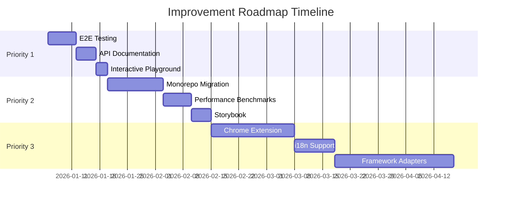

# 🚀 Improvement Roadmap: wizzard-stepper-react

> **Цель:** Поэтапное улучшение библиотеки до уровня Top-tier Open Source проектов (TanStack, react-hook-form)
>
> **Базовая оценка:** 9/10 (на основе анализа от 2026-01-04)
>
> **Целевая оценка:** 10/10

---

## 📋 Как использовать этот документ

1. **Для каждой задачи:**
   - `[ ]` - не начата
   - `[/]` - в процессе
   - `[x]` - завершена

2. **После завершения задачи:**
   - Отметить `[x]`
   - Заполнить секцию "Реализация"
   - Указать дату
   - Описать что сделано и почему

3. **Контекст:** Этот файл является источником истины для всех улучшений проекта

---

## 🎯 Priority 1: Critical (Срок: 1-2 недели)

### 1.1 E2E Testing Pipeline

**Статус:** `[ ]`

**Зачем:**
- Гарантия работоспособности всех user flows
- Предотвращение регрессий при рефакторинге
- Стандарт для production-ready библиотек

**Что делать:**

```bash
# Шаг 1: Установка Playwright
pnpm add -D @playwright/test

# Шаг 2: Инициализация
pnpm dlx playwright install
```

**Тест-кейсы для покрытия:**
- [ ] Базовая навигация (next/prev/goToStep)
- [ ] Валидация форм (с Zod и Yup адаптерами)
- [ ] Persistence (LocalStorage/Memory adapters)
- [ ] Conditional steps (dynamic branching)
- [ ] Middleware execution (logger, devtools)
- [ ] Error handling и validation errors
- [ ] Step guards (beforeLeave)
- [ ] Dependency tracking (dependsOn/clearData)

**Файлы для создания:**
```
/e2e
  /tests
    /basic-navigation.spec.ts
    /validation.spec.ts
    /persistence.spec.ts
    /conditional-steps.spec.ts
    /middleware.spec.ts
  /fixtures
    /test-wizard-config.ts
  playwright.config.ts
```

**Критерии завершения:**
- [ ] Минимум 8 E2E тестов покрывают все основные сценарии
- [ ] CI/CD pipeline запускает E2E тесты
- [ ] Локальная команда `pnpm test:e2e` работает

<details>
<summary>📝 Реализация (заполнить после выполнения)</summary>

**Дата реализации:** _____

**Что было сделано:**
- 

**Проблемы и решения:**
- 

**Метрики:**
- Количество тестов: _____
- Покрытие сценариев: _____%
- Время выполнения: _____ сек

</details>

---

### 1.2 API Documentation (TypeDoc)

**Статус:** `[ ]`

**Зачем:**
- Автогенерация документации из исходного кода
- Актуальная документация (синхронизация с кодом)
- Стандарт для TypeScript библиотек

**Что делать:**

```bash
# Шаг 1: Установка
pnpm add -D typedoc typedoc-plugin-markdown

# Шаг 2: Конфигурация
```

**Создать файл `typedoc.json`:**
```json
{
  "entryPoints": ["src/index.ts"],
  "out": "docs/api",
  "plugin": ["typedoc-plugin-markdown"],
  "readme": "none",
  "excludePrivate": true,
  "excludeProtected": true
}
```

**Добавить TSDoc комментарии для:**
- [ ] `IWizardConfig` и все его свойства
- [ ] `IStepConfig` и все его свойства
- [ ] `createWizardFactory` и все возвращаемые hooks
- [ ] `IValidatorAdapter` интерфейс
- [ ] `IPersistenceAdapter` интерфейс
- [ ] `WizardMiddleware` тип
- [ ] All public hooks (useWizard, useWizardValue, etc.)

**Добавить в package.json:**
```json
"scripts": {
  "docs:api": "typedoc",
  "docs:watch": "typedoc --watch"
}
```

**Критерии завершения:**
- [ ] TSDoc комментарии покрывают 100% публичного API
- [ ] Команда `pnpm docs:api` генерирует документацию
- [ ] Документация доступна в `/docs/api`
- [ ] GitHub Pages обновляется автоматически

<details>
<summary>📝 Реализация (заполнить после выполнения)</summary>

**Дата реализации:** _____

**Что было сделано:**
- 

**Примеры добавленных комментариев:**
```typescript
// Вставить пример
```

**Ссылка на сгенерированную документацию:** _____

</details>

---

### 1.3 Interactive Playground (StackBlitz)

**Статус:** `[ ]`

**Зачем:**
- Мгновенный опыт для новых пользователей
- Снижение порога входа
- Демонстрация возможностей библиотеки

**Что делать:**

**Создать шаблоны для StackBlitz:**
- [ ] **Basic Example** - простой wizard с 3 шагами
- [ ] **Validation Example** - с Zod валидацией
- [ ] **Persistence Example** - с LocalStorage
- [ ] **Conditional Steps** - динамические шаги
- [ ] **Advanced** - все фичи вместе

**Файлы для создания:**
```
/.stackblitz
  /basic
    /package.json
    /index.html
    /src/App.tsx
  /validation
    /...
  /persistence
    /...
```

**Добавить в README.md:**
```markdown
## 🎮 Try it Online

[](https://stackblitz.com/github/ZizzX/wizzard-stepper-react/tree/main/.stackblitz/basic)
```

**Критерии завершения:**
- [ ] 5 рабочих StackBlitz шаблонов
- [ ] Ссылки добавлены в README
- [ ] Шаблоны обновляются при изменении API

<details>
<summary>📝 Реализация (заполнить после выполнения)</summary>

**Дата реализации:** _____

**Созданные примеры:**
1. 
2. 
3. 

**Обратная связь от пользователей:** _____

</details>

---

## 🔥 Priority 2: High (Срок: 1-2 месяца)

### 2.1 Переход на Monorepo (pnpm workspaces)

**Статус:** `[ ]`

**Зачем:**
- Снизить bundle size с 41kB до ~10kB для core
- Tree-shaking на уровне пакетов
- Изоляция зависимостей
- Упростить добавление новых адаптеров

**Целевая структура:**
```
/packages
  /core              # 5-8kB - WizardStore, types, utils
  /react             # 3-5kB - WizardProvider, hooks, context
  /adapter-zod       # 2kB   - ZodAdapter + types
  /adapter-yup       # 2kB   - YupAdapter + types
  /devtools          # 5kB   - WizardDevTools, middleware
  /persistence-local # 1kB   - LocalStorageAdapter
```

**План миграции:**

**Фаза 1: Подготовка (1 день)**
- [ ] Создать `pnpm-workspace.yaml`
- [ ] Создать структуру `/packages`
- [ ] Настроить TypeScript project references

**Фаза 2: Разделение кода (3-5 дней)**
- [ ] Выделить core пакет
- [ ] Выделить react пакет
- [ ] Выделить адаптеры
- [ ] Выделить devtools

**Фаза 3: Build конфигурация (2 дня)**
- [ ] Настроить tsup для каждого пакета
- [ ] Настроить exports в package.json
- [ ] Проверить tree-shaking

**Фаза 4: Тестирование (2 дня)**
- [ ] Обновить все тесты
- [ ] Проверить все сценарии использования
- [ ] Обновить examples

**Фаза 5: Документация (1 день)**
- [ ] Обновить README
- [ ] Создать MIGRATION_v3.md
- [ ] Обновить docs

**Критерии завершения:**
- [ ] Core пакет < 10kB gzipped
- [ ] Все тесты проходят
- [ ] Backward compatibility сохранена
- [ ] Документация обновлена

<details>
<summary>📝 Реализация (заполнить после выполнения)</summary>

**Дата начала:** _____  
**Дата завершения:** _____

**Размеры пакетов (до):**
- Общий bundle: 41.6 kB

**Размеры пакетов (после):**
- @wizzard/core: _____
- @wizzard/react: _____
- @wizzard/adapter-zod: _____
- @wizzard/adapter-yup: _____

**Breaking changes:** _____

**Migration path для пользователей:** _____

</details>

---

### 2.2 Performance Benchmarks

**Статус:** `[ ]`

**Зачем:**
- Отслеживание регрессий производительности
- Сравнение с конкурентами
- Оптимизация критических путей

**Что измерять:**

1. **Re-render Count**
   - Количество re-renders при изменении одного поля
   - Сравнение: useWizard vs useWizardValue

2. **Memory Usage**
   - Размер store для wizard с 10/50/100 шагами
   - Memory leaks при unmount

3. **Validation Performance**
   - Время валидации с Zod/Yup
   - Debounce эффективность

4. **Bundle Impact**
   - Tree-shaking эффективность
   - Import size для разных сценариев

**Инструменты:**

```bash
# Установка
pnpm add -D vitest tinybench @vitest/ui

# Создать файлы
/benchmarks
  /re-renders.bench.ts
  /memory.bench.ts
  /validation.bench.ts
  /bundle-size.bench.ts
```

**Добавить в package.json:**
```json
"scripts": {
  "bench": "vitest bench",
  "bench:ui": "vitest bench --ui"
}
```

**Критерии завершения:**
- [ ] Бенчмарки для всех критических операций
- [ ] Baseline метрики зафиксированы
- [ ] CI проверяет регрессии
- [ ] Результаты опубликованы в docs

<details>
<summary>📝 Реализация (заполнить после выполнения)</summary>

**Дата реализации:** _____

**Baseline метрики:**
- Re-renders per field change: _____
- Memory per 100 steps: _____
- Validation time (Zod): _____
- Validation time (Yup): _____

**Найденные оптимизации:** _____

</details>

---

### 2.3 Storybook для Компонентов

**Статус:** `[ ]`

**Зачем:**
- Интерактивная документация компонентов
- Изолированная разработка
- Visual regression testing

**Что делать:**

```bash
# Установка
npx storybook@latest init

# Настройка для React + Vite
```

**Stories для создания:**
- [ ] `WizardDevTools` - все режимы отображения
- [ ] `WizardStepRenderer` - различные layouts
- [ ] Form integrations (примеры с react-hook-form)
- [ ] Validation scenarios (Zod/Yup errors)
- [ ] Persistence demo (LocalStorage interaction)

**Критерии завершения:**
- [ ] Минимум 10 stories
- [ ] Storybook деплоится на GitHub Pages
- [ ] Ссылка добавлена в README

<details>
<summary>📝 Реализация (заполнить после выполнения)</summary>

**Дата реализации:** _____

**Созданные stories:**
1. 
2. 

**URL Storybook:** _____

</details>

---

## 💡 Priority 3: Nice to Have (Срок: 3-6 месяцев)

### 3.1 Chrome DevTools Extension

**Статус:** `[ ]`

**Зачем:**
- Инструмент для debugging wizard state
- Похож на Redux DevTools
- Повышает DX для разработчиков

**Scope:**
- [ ] Time-travel debugging
- [ ] State inspection
- [ ] Action history
- [ ] Step navigation
- [ ] Persistence visualization

**Критерии завершения:**
- [ ] Extension опубликован в Chrome Web Store
- [ ] Документация по использованию

<details>
<summary>📝 Реализация (заполнить после выполнения)</summary>

**Дата реализации:** _____

</details>

---

### 3.2 Internationalization (i18n) для Errors

**Статус:** `[ ]`

**Зачем:**
- Поддержка мультиязычных приложений
- Встроенная локализация ошибок валидации

**Scope:**
- [ ] i18n адаптер для validation errors
- [ ] Примеры для 3-5 языков
- [ ] Документация

<details>
<summary>📝 Реализация (заполнить после выполнения)</summary>

**Дата реализации:** _____

</details>

---

### 3.3 Framework Adapters (Vue/Svelte)

**Статус:** `[ ]`

**Зачем:**
- Расширение аудитории
- WizardStore уже framework-agnostic

**Scope:**
- [ ] @wizzard/vue
- [ ] @wizzard/svelte
- [ ] @wizzard/solid

<details>
<summary>📝 Реализация (заполнить после выполнения)</summary>

**Дата реализации:** _____

</details>

---

## 📊 Tracking Progress

### Overall Completion

**Priority 1 (Critical):** `0/3` (0%)
- [ ] E2E Testing
- [ ] API Documentation
- [ ] Interactive Playground

**Priority 2 (High):** `0/3` (0%)
- [ ] Monorepo Migration
- [ ] Performance Benchmarks
- [ ] Storybook

**Priority 3 (Nice to Have):** `0/3` (0%)
- [ ] Chrome Extension
- [ ] i18n Support
- [ ] Framework Adapters

---

## 📅 Timeline



---

## 🎯 Success Metrics

### Цель v3.0.0 (после всех Priority 1-2 улучшений)

| Метрика | Текущее | Целевое |
|---------|---------|---------|
| **Bundle Size (core)** | 41.6 kB | < 10 kB |
| **Test Coverage** | ~60% | > 90% |
| **E2E Tests** | 0 | > 8 |
| **Documentation Score** | 7/10 | 10/10 |
| **Performance (re-renders)** | baseline | < baseline |
| **GitHub Stars** | - | 1000+ |
| **NPM Downloads** | - | 10k+/month |

---

## 📝 Notes & Decisions

### 2026-01-04: Roadmap Created
- Создан базовый roadmap на основе comprehensive analysis
- Приоритеты расставлены исходя из impact vs effort
- Timeline оценен для solo developer

### Future Notes
_Здесь записывать важные решения и изменения планов_

---

## 🔄 Review Schedule

- **Weekly Review:** Каждую пятницу проверять прогресс
- **Monthly Review:** Обновлять timeline и приоритеты
- **Quarterly Review:** Оценивать достижение success metrics

---

**Last Updated:** 2026-01-04  
**Next Review:** 2026-01-11
